## 프로젝트 개요
- 도서관의 책 관리 시스템으로 책의 등록 및 대여/반납을 할 수 있다
- 총 대여 횟수와 월간 대여 횟수 통계를 조회 할 수 있다

### 사용법
- 터미널에 각 메뉴에 맞는 번호를 입력하면 메뉴에 진입하여 기능을 수행할 수 있다

1. 도서 등록
    - 책 제목, 저자, ISBN, 일반or전자 도서 여부를 입력하여 책을 등록할 수 있다
    - ISBN 은 중복하여 입력할 수 없다
2. 전체 도서 조회
    - 현재 등록된 모든 도서를 출력한다
3. 도서 검색
    - 책 제목, 저자, ISBN 을 입력하면 해당하는 도서를 출력한다
    - 동일한 제목, 저자인 경우 여러 도서가 출력된다
4. 대여/반납 처리
    - 현재 대여 중인 도서 목록을 검색해 볼 수 있다
    - ISBN 입력으로 도서를 대여/반납 처리 할 수 있다
    - 대여 중이 아닌 도서를 대여 상태로 변경 할 수 있다
    - 대여 중인 도서를 대여 가능 상태로 변경 할 수 있다
5. 통계 조회
    - 가장 많이 대여된 도서 : 총 대여된 횟수를 내림차순으로 출력 한다
    - 월간 대여 통계 : 검색하는 시점의 월에 가장 많이 대여한 도서를 출력한다

### 프로그램 동작 화면

1. 메인 화면
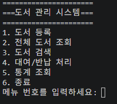

2. 도서 등록
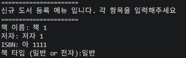

3. 전체 도서 조회
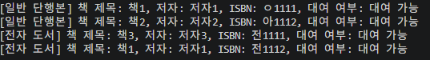

4. 도서 조건 검색
- 책 제목 검색
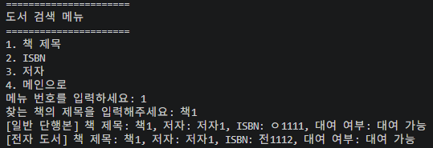

- ISBN 검색
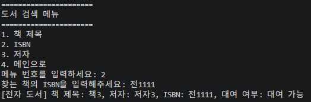

- 저자 검색
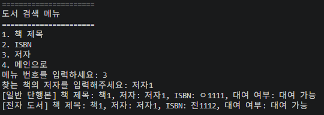

5. 도서 대여/반납

- 도서 대여
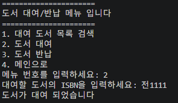

- 도서 반납
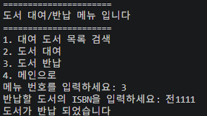

- 대여 상태인 도서 검색
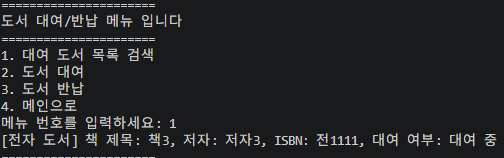

6. 통계 조회

- 가장 많이 대여된 도서
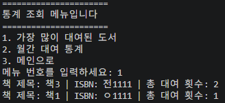

- 월간 대여 도서
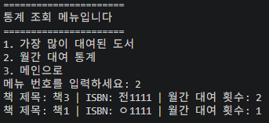

### 데이터 구조

- 도서 저장
    - books = {ISBN:book} - ISBN을 키로 값으로 book 객체를 받는다 book 객체는 Paper_book 나 E_book 클래스에서 생성한 객체이다
    - record = [ISBN, 저장된 시간,'대여'OR'반납']
    - libarary_data = {'books' : books, 'record' : record} - books 와 record를 저장해 pickle 를 이용해 libary.pkl 파일로 저장하거나 읽어온다